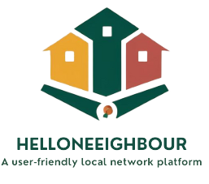

# Hello Neighbor 🌍
**ALX Africa Final Project**
*Developed by Montassar Hajri*

[](https://react.dev/)
[](https://www.typescriptlang.org/)
[](https://supabase.io/)
[](https://www.alxafrica.com/)

A community-focused web application connecting neighbors through localized communication, events, and resource sharing.


*Hello Neighbor - Building stronger communities*

## Table of Contents
- [Key Features](#key-features-)
- [Tech Stack](#tech-stack-)
- [Installation](#installation-)
- [Usage](#usage-)
- [Database Schema](#database-schema-)
- [Development Insights](#development-insights-)
- [Roadmap](#roadmap-)
- [Contributing](#contributing-)
- [License](#license-)
- [Acknowledgments](#acknowledgments-)
- [Contact](#contact-)

## Key Features ✨

### Community Engagement
- 🗺️ Location-verified neighborhood access
- 📅 Event management with RSVP system
- 🚨 Real-time emergency alerts
- 💬 Neighborhood chat channels

### Marketplace
- 🛒 Local item exchange platform
- 🔍 Geo-fenced search radius
- 📸 Image upload for listings
- 🤝 Peer-to-peer rating system

### Security & Privacy 🔒
- 📍 GPS verification with fallback
- 🔐 Role-based access control
- 🛡️ End-to-end encryption for messages
- 🕵️ Anonymous reporting system

## Tech Stack 🛠️

### Frontend
| Technology          | Purpose                          |
|---------------------|----------------------------------|
| React 18 + TS       | Core framework                   |
| Vite                | Build tool & bundling            |
| Tailwind CSS        | Styling system                   |
| Shadcn UI           | Accessible components            |
| React Router 6      | Navigation management            |
| React Query         | Server state management          |
| react-leaflet       | Map integrations                 |

### Backend (Supabase)
| Feature             | Implementation                   |
|---------------------|----------------------------------|
| PostgreSQL          | Relational database              |
| PostGIS             | Geographic data handling         |
| RLS Policies        | Data access control              |
| Storage Buckets     | File upload management           |
| Edge Functions      | Custom serverless logic          |
| Realtime API        | Live updates subscription        |

## Installation 📦

### Prerequisites
- Node.js 18+ and npm
- Supabase account (free tier available)
- Git

### Setup Instructions

1. **Clone the repository**
```bash
git clone https://github.com/yourusername/HelloNeighbor-community-web-application.git
cd HelloNeighbor-community-web-application
```

2. **Install dependencies**
```bash
npm install
```

3. **Configure environment variables**
Create a `.env` file in the root directory:
```env
VITE_SUPABASE_URL=your_supabase_url
VITE_SUPABASE_ANON_KEY=your_supabase_anon_key
```

4. **Set up Supabase database**
- Create a new Supabase project
- Run the SQL migrations in `backup.sql`
- Configure Row Level Security (RLS) policies using `fix-rls-policies.sql`

5. **Start the development server**
```bash
npm run dev
```

The application will be available at `http://localhost:5173`

## Usage 🚀

### Running in Development
```bash
npm run dev
```

### Building for Production
```bash
npm run build
npm run preview
```

### Linting & Type Checking
```bash
npm run lint
npm run type-check
```

### Deploying to Netlify
The project includes a `netlify.toml` configuration. Simply connect your GitHub repository to Netlify for automatic deployments.

## Database Schema 🗄️

The application uses PostgreSQL with PostGIS for geographic data. Key tables include:

- **users** - User profiles with location data
- **neighborhoods** - Community boundaries and settings
- **posts** - Community posts and announcements
- **events** - Local events with RSVP tracking
- **marketplace_listings** - Item exchange platform
- **messages** - Neighborhood chat conversations
- **alerts** - Emergency notifications

See `backup.sql` for the complete schema and RLS policies.

## Development Insights 💡

### Architecture Decisions
- **Component-based design** using Shadcn UI for consistent, accessible interfaces
- **React Query** for efficient server state management and caching
- **Row Level Security** for robust data isolation between neighborhoods
- **PostGIS** for spatial queries and location verification

### Key Challenges Solved
- Geographic verification with graceful fallback mechanisms
- Real-time updates across neighborhood boundaries
- Secure file upload and storage with Supabase
- Optimized map rendering with leaflet integration

## Roadmap 🗺️

- [ ] Mobile app development (React Native)
- [ ] Push notification system
- [ ] Advanced moderation tools
- [ ] Multi-language support
- [ ] Integration with local government APIs
- [ ] Offline mode support

## Contributing 🤝

Contributions are welcome! Please follow these steps:

1. Fork the repository
2. Create a feature branch (`git checkout -b feature/amazing-feature`)
3. Commit your changes (`git commit -m 'Add amazing feature'`)
4. Push to the branch (`git push origin feature/amazing-feature`)
5. Open a Pull Request

Please ensure your code follows the existing style guidelines and includes appropriate tests.

## License 📄

This project is licensed under the MIT License - see the [LICENSE](LICENSE) file for details.

## Acknowledgments 🙏

- [ALX Africa](https://www.alxafrica.com/) for the Software Engineering program
- [Supabase](https://supabase.io/) for the backend infrastructure
- [Shadcn UI](https://ui.shadcn.com/) for the component library
- The open-source community for continuous inspiration

## Contact 📧

**Montassar Hajri**

- GitHub: [@MontaCoder](https://github.com/montacoder)


---

⭐ Star this repo if you find it helpful!

